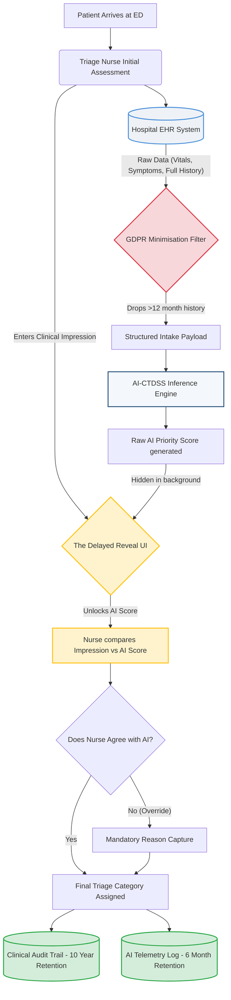

# AI Governance Framework for a High-Risk Clinical Decision Support System
### A Portfolio Project in AI Governance, Risk, and Compliance (GRC)

**Author:** Vasu Sharma
**Domain:** HealthTech AI Governance
**Regulatory Scope:** EU AI Act (2024/1689) · EU MDR (2017/745) · GDPR (2016/679)
**Date:** August 2026
**Version:** 3.0 (Self-Assessed / Portfolio Exercise)

---

> **About This Document**
> This framework demonstrates the operational translation of the EU AI Act, GDPR, and EU Medical Device Regulation into a single compliance architecture for a high-risk clinical triage AI. It is built from primary regulatory texts and supported by published industry intelligence from OECD, McKinsey & Company, and Deloitte.

# Executive Summary
*(Updated with Industry & Regulatory Citations — OECD, EU AI Act, GDPR, MDR)*

---

**System:** AI-based Clinical Triage Decision Support System (AI-CTDSS)
**Regulatory Environment:** EU Medical Device Regulation (MDR 2017/745) · EU Artificial Intelligence Act (2024/1689) · General Data Protection Regulation (GDPR 2016/679)

This document serves as the comprehensive governance framework for the deployment of an AI-CTDSS within a European emergency department setting. The system analyzes patient intake data (vitals and symptoms) to recommend a triage priority score to the attending triage nurse. It is unambiguously classified as a **Class IIa Medical Device** under MDR Annex VIII Rule 11, and a **High-Risk AI System** under Article 6(1) and 6(2) of the EU AI Act — the first comprehensive AI regulation enacted globally, entering full enforcement for Annex I medical devices in August 2028 (per Digital Omnibus Reg. 2026/1744).

The OECD (*Progress in Implementing the EU Coordinated Plan on AI, Volume 2: Uptake in High-Impact Sectors*, 2026) explicitly identifies navigating the overlapping requirements of the EU AI Act, GDPR, and Medical Device Regulation as one of the primary structural barriers to AI adoption in European healthcare — recommending that developers and deployers pursue *"consolidated guidance to streamline requirements... and, where feasible, a single technical dossier."* This framework is a direct operational response to that challenge: it is designed to **unify these three compliance pathways into a single operational architecture**, treating each regulatory obligation not in isolation but as part of an integrated system.

---

## Key Governance Design Decisions

### 1. Dual-Purpose Human Oversight
*Addresses: GDPR Article 22 · EU AI Act Article 14*

The framework designs human oversight as the core decision architecture, not a compliance checkbox. The AI-CTDSS operates strictly as a recommendation engine. The triage nurse must input an initial clinical impression before the AI score is revealed (preventing automation bias anchoring), and retains final, unlockable authority over the triage category.

This single design mechanism satisfies two independent legal obligations simultaneously:
- **GDPR Article 22:** Ensures the triage decision is never "based solely on automated processing," protecting patients' right not to be subject to purely automated decisions.
- **EU AI Act Article 14:** Enforces "effective human oversight by natural persons" for high-risk AI systems, including the ability to understand outputs, identify risks, and intervene or override.

### 2. Code-to-Documentation Linkage and Ownership
*Addresses: EU AI Act Article 11 · Annex IV (Technical Documentation)*

Documentation failure is the primary post-deployment compliance risk. The framework implements a RACI-driven ownership model where every regulatory obligation is assigned to a named organizational role. Critically, no model update can be deployed unless the corresponding technical documentation has been explicitly signed off by its respective owners — creating a hard gate between model retraining and clinical deployment.

### 3. Unified Post-Market Monitoring and Telemetry
*Addresses: EU AI Act Articles 12 & 72 · MDR Article 87*

The framework structurally aligns clinical safety monitoring with regulatory monitoring. By requiring a sub-2-second reason capture for every clinician override, the system generates a live telemetry feed for the Clinical Governance team. The EU AI Act Article 72 mandates continuous post-market monitoring for high-risk systems; MDR Article 87 mandates external reporting of serious incidents within 15 days (or 10 days for events involving death or serious deterioration). Per-inference model version logging (detailed in Section 6 of this framework, in compliance with EU AI Act Article 12) ensures root-cause analysis is always technically feasible following an adverse event.

---
*Sources: EU AI Act 2024/1689, Articles 6, 12, 14, 72, Annex IV; GDPR 2016/679, Article 22; MDR 2017/745, Article 87.*

# Section 1: System Definition and Scope
*(Updated with Regulatory Citations — EU MDR 2017/745 & EU AI Act 2024/1689)*

---

## 1.1 Executive Overview

This document establishes the foundational scope and system definition for the AI Clinical Triage Decision Support System (AI-CTDSS). A robust AI governance framework relies fundamentally on precise system boundaries. Ambiguity in system definition creates legal, compliance, and clinical safety gaps throughout the lifecycle of the product. This section outlines exactly what the AI-CTDSS is, who it is for, its operational boundaries, and its primary regulatory classification, serving as the basis for all subsequent governance, risk management, and compliance (GRC) activities.

## 1.2 System Description

The **AI Clinical Triage Decision Support System (AI-CTDSS)** is a machine learning-based clinical decision support tool designed for deployment at hospital emergency department (ED) intake. Its primary function is to analyze acute patient presentations and recommend an initial triage priority score to the attending triage clinician.

**Data Ingestion Pipeline:**
At the point of registration and initial assessment, the AI-CTDSS ingests four primary categories of patient intake data:
1. **Presenting Symptoms:** Chief complaints as recorded by the intake nurse or self-reported by the patient (natural language processed or structured inputs).
2. **Measured Vitals:** Objective physiological measurements including Blood Pressure (BP), Heart Rate (HR), Peripheral Oxygen Saturation (SpO2), Respiratory Rate, and Temperature.
3. **Medical History:** Relevant, self-reported historical medical data (e.g., known chronic conditions, current primary medications).
4. **Demographic Data:** Age and biological sex, which are critical variables for certain acute clinical risk scores.

**Output Generation:**
Based on this multi-modal ingestion, the AI-CTDSS processes the data through its predictive algorithms to produce a **triage priority score ranging from 1 to 5**, strictly aligned with the established Manchester Triage System (MTS) categories. This algorithmic output is presented to the attending triage nurse via the Electronic Health Record (EHR) interface as a clinical *recommendation*, accompanied by a confidence interval and the key variables driving the recommendation.

### System Architecture & Data Flow Diagram

This diagram visually maps the flow of patient data through the AI-CTDSS, highlighting where specific regulatory controls (GDPR Data Minimisation, EU AI Act Human Oversight) are technically enforced.

**Strategic Highlights of this Architecture:**
- **The Minimisation Filter (GDPR Art. 5):** The AI never touches the patient's entire medical record, stripping out irrelevant data before inference to reduce statistical noise and privacy liability.
- **The Delayed Reveal UI (GDPR Art. 22 & AI Act Art. 14):** The AI score is physically blocked from the nurse's view until they commit their own clinical impression. This breaks the "automation bias" feedback loop.
- **Bifurcated Logging (AI Act Art. 12 & MDR):** Clinical records are kept for 10 years (patient safety), but raw AI telemetry is purged after 6 months to minimize data exposure.
## 1.3 Intended Purpose and Intended Users

### Intended Purpose
The explicit intended purpose of the AI-CTDSS is to **inform and assist** the triage category assignment process in high-volume, time-sensitive emergency care environments. By synthesizing disparate data points rapidly, it aims to reduce cognitive load on clinicians, minimize human error in under-triage scenarios (where a critical patient is incorrectly assessed as non-urgent), and standardize triage acuity scoring across different shifts and personnel.

### Intended Users
The AI-CTDSS is exclusively designed for use by qualified healthcare professionals. The primary intended users are:
- **Triage Nurses:** The primary operators who conduct the initial patient assessment and make the final triage categorization.
- **Emergency Physicians:** Secondary users who may reference the AI-CTDSS score during subsequent clinical evaluation or patient flow management.

### Explicit Non-Purposes (What the System Does NOT Do)
To prevent off-label usage and contain legal liability, it must be explicitly stated what the system is not authorized to do:
- **It does NOT diagnose:** The system evaluates acuity and urgency; it does not identify underlying pathology or disease states.
- **It does NOT prescribe:** It offers no therapeutic or pharmacological recommendations.
- **It does NOT dictate admission or discharge:** Final patient disposition remains entirely outside the system's operational purview.
- **It does NOT automate decisions:** The system is explicitly designed as a "decision support" tool. It cannot autonomously assign a triage score without human review and confirmation.

## 1.4 System Boundaries

Defining the boundaries of the AI-CTDSS is a critical governance exercise. The following elements are explicitly **out of scope** for the current system architecture and subsequent compliance obligations:

- **Medical Imaging:** The AI-CTDSS does not process, analyze, or ingest radiological data (X-rays, CT, MRI, ultrasound). Systems involving radiological computer-aided triage (CADt) require distinct regulatory pathways.
- **Pediatric Triage:** The current iteration of the AI-CTDSS model has been trained primarily on adult populations. Due to the physiological differences and unique triage scales for pediatrics, patients under the age of 16 are out of scope. The system must feature a hard stop or bypass mechanism for pediatric intakes.
- **Mass Casualty Incidents (MCI):** The model is calibrated for routine emergency department operations. It is not designed to govern triage in disaster or mass casualty scenarios where reverse triage or fundamentally different ethical and clinical guidelines apply.

## 1.5 Regulatory Classification

Based on its intended purpose and operational mechanics, the AI-CTDSS operates at the intersection of two major EU regulatory frameworks.

### 1.5.1 Medical Device Classification (EU MDR 2017/745)

The system is classified as **Software as a Medical Device (SaMD)**. The EU Medical Device Regulation (EU MDR 2017/745) defines a medical device as "any instrument, apparatus, appliance, software… intended by the manufacturer to be used, alone or in combination… for the purpose of diagnosis, prevention, monitoring, prediction, prognosis, treatment or alleviation of disease."

The AI-CTDSS squarely meets this definition as software intended to inform clinical decisions with diagnostic intent (urgency classification).

**Risk Classification — Class IIa:**
Under Annex VIII, Rule 11 of the EU MDR, software intended to provide information used for decisions with diagnostic or therapeutic purposes is classified according to the severity of the health impact if the decision is incorrect:

> *"Software intended to provide information which is used to take decisions with diagnosis or therapeutic purposes is classified as class IIa, except if such decisions have an impact that may cause:... serious deterioration of a person's state of health or a surgical intervention, in which case it is in class IIb..."* — MDR Annex VIII, Rule 11

Because the AI-CTDSS influences triage assignment in emergency situations where an under-triage error could lead to serious deterioration of health (e.g., a patient in early septic shock triaged as non-urgent), it is classified as a **Class IIa** medical device. This classification triggers the requirement for a conformity assessment by a **Notified Body** and affixing the **CE Mark** before market placement.

**Key MDR Obligations This Classification Triggers:**
- Maintenance of a **Technical File** (equivalent to the Technical Documentation defined in this framework).
- A **Post-Market Surveillance (PMS) system** for the lifetime of the device (see Section 8).
- Registration in the **EUDAMED** database.
- Clinical Evaluation and continued performance assessment.

### 1.5.2 Artificial Intelligence Classification (EU AI Act 2024/1689)

The EU AI Act (Regulation 2024/1689, in force from August 2024) establishes the first comprehensive legal framework for artificial intelligence in the world. Under this regulation, the AI-CTDSS is unambiguously classified as a **High-Risk AI System**.

This classification derives from two independent grounds:

**Ground 1 — Product Safety Component (Article 6(1)):**
The AI Act classifies as high-risk any AI system that is a safety component of a product covered by EU harmonization legislation listed in Annex I. The EU MDR is listed in Annex I. Because the AI-CTDSS is SaMD governed by the MDR, it is automatically high-risk.

**Ground 2 — Annex III Enumerated Use Case (Article 6(2)):**
Annex III, Point 5(a) captures AI systems "intended to be used by or on behalf of public authorities or Union institutions, bodies, offices or agencies to evaluate the eligibility of natural persons for essential public services and benefits" — which the EU Commission has clarified includes AI used to prioritize access to emergency healthcare. A triage system directly determines the order and urgency of care provision, placing it within this enumerated category.

**Key High-Risk AI Act Obligations Triggered:**
| Obligation | Relevant Section of This Framework |
| :--- | :--- |
| Risk Management System (Art. 9) | Section 2 |
| Data Governance (Art. 10) | Section 3 |
| Technical Documentation (Art. 11) | Section 5 |
| Record Keeping & Logging (Art. 12) | Section 6 |
| Transparency to Operators (Art. 13) | Section 7 |
| Human Oversight (Art. 14) | Section 4 |
| Accuracy & Robustness (Art. 15) | Section 8 |

### 1.5.3 Regulatory Jurisdiction

For the purposes of this governance framework, we assume initial deployment within the European Union (Germany). Therefore, the system falls under the jurisdiction of:
- **BfArM** (Federal Institute for Drugs and Medical Devices) — MDR oversight.
- **BfDI** (Federal Commissioner for Data Protection and Freedom of Information) — GDPR oversight.
- The designated national AI supervisory authority — EU AI Act oversight.

---
*Sources: EU Medical Device Regulation 2017/745, Annex VIII, Rule 11; EU Artificial Intelligence Act 2024/1689, Articles 6, 9-15, Annex I, Annex III.*

# Section 2: Risk Classification Analysis
*(Updated with Industry & Regulatory Citations — McKinsey, EU AI Act, MDR 2017/745)*

---

## 2.1 Overview

To establish the regulatory obligations for the AI-CTDSS, we must formally determine its risk classification under the EU Artificial Intelligence Act (Regulation 2024/1689). The AI Act employs a tiered, risk-based approach — ranging from minimal to unacceptable risk — to ensure that regulatory burdens are proportionate to the potential for harm.

This section provides a rigorous, auditable walkthrough of the classification criteria. It is not sufficient to merely state that a clinical system is "high-risk." Governance requires demonstrating the **precise legal pathways** that mandate this classification, enabling legal, product, and Notified Body stakeholders to validate the logic independently.

> *"Non-compliance with the [AI Act's] rules on high-risk AI systems shall be subject to administrative fines of up to 15,000,000 EUR or, if the offender is an undertaking, up to 3% of its total worldwide annual turnover."* — EU AI Act Article 99(4)

McKinsey & Company (*The European Union AI Act: Time to start preparing*, November 2024) underlines the strategic severity of non-compliance, noting maximum fines of up to **35,000,000 EUR or 7% of global turnover** for violations of prohibited AI practices (EU AI Act Article 99(3)), and **15,000,000 EUR or 3%** for non-compliance with high-risk AI system obligations (Article 99(4)). McKinsey's central recommendation is that organizations treat compliance not as a one-time certification event but as a **continuous governance programme** — precisely the philosophy this framework embeds through its RACI model, Code-to-Documentation gating, and ongoing Post-Market Monitoring cadence. The classification below ensures the AI-CTDSS avoids these existential regulatory risks by achieving defensible, documented high-risk compliance from day one.

---

## 2.2 Step 1: Application of Annex III Criteria

Annex III of the EU AI Act enumerates specific use cases that automatically qualify an AI system as high-risk. A systematic assessment against each Annex III category:

| Annex III Category | Applicable? | Rationale |
| :--- | :--- | :--- |
| Point 1 — Biometric identification | ❌ No | System does not perform biometric identification |
| Point 2 — Critical infrastructure | ❌ No | Not applicable |
| Point 3 — Education | ❌ No | Not applicable |
| Point 4 — Employment | ❌ No | Not applicable |
| Point 5a — Essential public services | ✅ Yes | Independent ground for high-risk classification (emergency healthcare triage) |
| Point 6 — Law enforcement | ❌ No | Not applicable |
| Point 7 — Migration / border control | ❌ No | Not applicable |
| Point 8 — Administration of justice | ❌ No | Not applicable |
| **Safety component in harmonized legislation (MDR)** | ✅ **Primary basis** | See Section 2.3 |

---

## 2.3 Step 2: The MDR Cross-Reference (EU AI Act Article 6(1))

Article 6(1) of the EU AI Act states that an AI system is high-risk if it is "intended to be used as a safety component of a product, or is itself a product, covered by the Union harmonization legislation listed in Annex I" — and that product requires third-party conformity assessment. The EU MDR (2017/745) is listed in Annex I.

To validate this path, we assess the AI-CTDSS under the MDR's SaMD classification rules:

**Step A — Medical Device Definition (MDR Article 2(1)):**
The MDR defines a medical device as "any instrument, apparatus, appliance, software… intended by the manufacturer to be used… for the purpose of diagnosis, prevention, monitoring, prediction, prognosis, treatment or alleviation of disease." The AI-CTDSS provides information to support decisions with diagnostic intent (urgency/acuity classification). It qualifies.

**Step B — MDR Classification (Annex VIII, Rule 11):**
> *"Software intended to provide information which is used to take decisions with diagnosis or therapeutic purposes is classified as class IIa, except if such decisions have an impact that may cause: — serious deterioration of a person's state of health or a surgical intervention, in which case it is in class IIb."* — MDR Annex VIII, Rule 11

**Step C — Application to AI-CTDSS:**
In emergency triage, an incorrect assessment (under-triage) can directly delay critical care, leading to serious deterioration of patient health. The system is therefore classified as a minimum of **Class IIa**, requiring third-party Notified Body conformity assessment under MDR.

**Conclusion:** Because the AI-CTDSS is a Class IIa medical device requiring Notified Body assessment, it triggers **automatic high-risk classification under EU AI Act Article 6(1).**

---

## 2.4 Step 3: EU AI Act Article 6(2) and 6(3) Independent Self-Assessment

Even absent the MDR cross-reference, EU AI Act Article 6(2) provides an independent pathway by classifying AI systems listed in Annex III as high-risk. While EU AI Act Article 6(3) provides a derogation (exemption) for Annex III systems if they do not pose a "significant risk of harm" to health, safety, or fundamental rights, the AI-CTDSS does not qualify for this exemption.

| Assessment Criterion | Finding |
| :--- | :--- |
| Risk profile | Directly influences the prioritization of emergency medical care |
| Harm potential | Algorithmic error or bias can result in a critical patient being categorized as non-urgent |
| Nature of harm | Direct, significant, and foreseeable risk to patient health and life |
| **Conclusion** | **Independently meets the EU AI Act Article 6(2) threshold (via Annex III) and does not qualify for the EU AI Act Article 6(3) exemption** |

---

## 2.5 Classification Conclusion

The AI-CTDSS is classified as a high-risk AI system under EU AI Act Article 6(1) as a safety component in a medical device subject to Regulation (EU) 2017/745 (MDR) requiring third-party conformity assessment. It is independently classified as high-risk under EU AI Act Article 6(2) (via Annex III) and cannot claim the EU AI Act Article 6(3) exemption due to its potential for significant harm to patient safety through incorrect urgency classification.

This dual-justification ensures robust regulatory positioning and mandates compliance with all high-risk AI system requirements under Articles 9 through 15 of the EU AI Act — including risk management, data governance, technical documentation, transparency, human oversight, accuracy, and robustness.

---
*Sources: EU Artificial Intelligence Act 2024/1689, Articles 6(1), 6(2), 99(3), 99(4), Annex I, Annex III; EU Medical Device Regulation 2017/745, Article 2(1), Annex VIII Rule 11; McKinsey & Company (2024), The European Union AI Act: Time to start preparing, McKinsey.com.*

# Section 3: GDPR Compliance Architecture
*(Updated with Regulatory Citations — GDPR 2016/679 & EU AI Act Art. 10)*

---

## 3.1 Overview

Because the AI-CTDSS ingests and processes patient health information to generate triage scores, it fundamentally operates on **special category data** as defined by Article 9 of the General Data Protection Regulation (GDPR 2016/679).

A core principle of AI governance is that data governance and system governance are functionally inseparable. The decisions made regarding the lawful basis for processing, data minimisation, and data subject rights directly constrain and shape how the AI system operates and how it is held accountable under the EU AI Act. This section outlines the integrated legal and operational architecture required to lawfully process data within the AI-CTDSS framework.

## 3.2 Part A: Legal Basis for Processing

Processing health data under GDPR requires a **dual legal basis**: a lawful basis under Article 6, and a specific condition for processing special category data under Article 9. For the deployment of the AI-CTDSS in a public hospital setting, the architectural alignment is as follows:

1. **Article 6(1)(e) — Public Interest:** The processing is necessary for the performance of a task carried out in the public interest or in the exercise of official authority vested in the controller (the hospital). Emergency triage is a core public health function.
   > *"Processing shall be lawful only if and to the extent that at least one of the following applies: (e) processing is necessary for the performance of a task carried out in the public interest..."* — GDPR Article 6(1)(e)

2. **Article 9(2)(h) — Health or Social Care:** The processing of special category (health) data is lawful because it is "necessary for the purposes of preventive or occupational medicine… medical diagnosis, the provision of health or social care or treatment."
   > *"Processing of personal data revealing racial or ethnic origin, political opinions... data concerning health... shall be prohibited. Paragraph 1 shall not apply if... (h) processing is necessary for the purposes of preventive or occupational medicine..."* — GDPR Article 9(1) and 9(2)(h)

> [!IMPORTANT]
> Relying on consent (Articles 6(1)(a) and 9(2)(a)) is **explicitly avoided** as the legal basis. In an emergency medical context, patients are often in acute distress, meaning consent cannot be deemed "freely given," informed, or unambiguous — thereby legally invalidating it.

## 3.3 Part B: Data Minimisation Design (GDPR Article 5(1)(c))

The GDPR mandates that data collection be "adequate, relevant and limited to what is necessary in relation to the purposes for which they are processed" (GDPR Art. 5(1)(c) — the data minimisation principle). This principle intersects directly with AI model quality, as over-collection can introduce statistical noise and bias.

The data inputs for the AI-CTDSS are strictly governed by the following minimisation parameters:

| Data Input | Necessity Assessment | Governance Control |
| :--- | :--- | :--- |
| Presenting Symptoms | **Necessary** — primary clinical anchor for the model | None required |
| Measured Vitals (BP, HR, SpO2, Temp) | **Necessary** — objective physiological baseline | SpO2 bias monitoring (see Section 3.7) |
| Age and Biological Sex | **Necessary but Monitored** — required for clinical accuracy; introduces demographic bias risk | Isolated in feature importance logging; bias audit at ±5% variance |
| Recent Medical History (last 12 months only) | **Conditionally Necessary** — restricted to recent history and active clinical flags only | Hard architectural limit: no access to full EHR history |

> **Note:** Restricting medical history ingestion to 12 months is a deliberate design choice to satisfy both data minimisation (GDPR Art. 5(1)(c)) and to prevent the model from being confused by outdated or irrelevant chronic history.

## 3.4 Part C: Data Retention Schedule

The retention of data processed by the AI-CTDSS creates a regulatory tension between three competing frameworks. The governance architecture resolves this by applying the maximum mandatory retention period based on the data's function:

| Regulatory Obligation | Data Category | Required Retention |
| :--- | :--- | :--- |
| EU AI Act, Articles 12 & 19 | Technical/system logs | Minimum 6 months |
| MDR — Post-Market Surveillance | Device performance records | Up to 10 years |
| National Clinical Records Law (e.g., Germany §10 MBO-Ä) | Patient triage records | Minimum 10 years |

**Resolution:** Patient triage records (the AI recommendation + the clinician's final decision + the input data) are classified as clinical records and retained within the EHR for **10 years**. Purely technical AI system logs (latency, model telemetry) are stripped of direct patient identifiers after 6 months to minimize identifiable data while fulfilling AI Act obligations.

## 3.5 Part D: Data Subject Rights and GDPR Article 22

The AI-CTDSS must facilitate standard GDPR rights (Access — Art. 15, Rectification — Art. 16, Restriction — Art. 18). However, the most critical architectural requirement stems from **Article 22**, which grants data subjects:

> *"The right not to be subject to a decision based solely on automated processing, including profiling, which produces legal effects concerning him or her or similarly significantly affects him or her."* — GDPR Article 22(1)

Because an emergency triage score significantly affects a patient — determining the urgency and order of their care — the system must be explicitly designed to avoid "solely automated" classification.

**The Integrated Solution:**
The design mechanism that satisfies GDPR Article 22 is the exact same mechanism that satisfies EU AI Act Article 14 (Human Oversight). The AI-CTDSS operates strictly as a **recommendation engine**. A qualified human clinician always makes the final triage categorization — the process is never "solely automated," legally neutralizing the Article 22 restriction while simultaneously complying with Article 14.

> This dual compliance through a single design mechanism (human-in-the-loop) is a deliberate architectural efficiency and a key strength of this governance framework's design.

## 3.6 Part E: Data Protection Impact Assessment (DPIA)

Under GDPR Article 35, a DPIA is mandatory when processing is "likely to result in a high risk to the rights and freedoms of natural persons." The EU Data Protection Authorities' guidelines clarify that processing special category health data using automated profiling or decision-support systems **automatically triggers** this requirement.

The DPIA for the AI-CTDSS is a mandatory pre-deployment artefact and must be maintained as a living document by the Data Protection Officer (DPO), reviewed:
- **Annually**, at minimum.
- **Immediately** following any significant model update or change in data processing scope.

The DPIA structure answers four core questions:

1. **Nature, Scope, Context, and Purposes:** What is being processed and why? *(Answered in Sections 1 & 3.2).*
2. **Necessity and Proportionality:** Is the data collection minimized? *(Answered in Section 3.3).*
3. **Risks to Rights and Freedoms:** What happens if the data is breached, or the algorithm discriminates against a protected group?
4. **Mitigation Measures:** How are these risks reduced? *(e.g., pseudonymization of telemetry logs, human-in-the-loop override requirements, robust cybersecurity controls).*

## 3.7 Part F: Algorithmic Fairness Assessment (EU AI Act Article 10)

Bias and algorithmic fairness are not merely ethical considerations; they are **strict regulatory requirements** under EU AI Act Article 10, which mandates that training and validation data be:

> *"...relevant, sufficiently representative, and to the best extent possible, free of errors and complete... having regard to the intended purpose of the high-risk AI system... appropriate data governance and management practices shall apply."* — EU AI Act Article 10(2)-(3)

**1. Known Clinical Bias Risks in Triage:**

| Bias Type | Mechanism | Mitigation |
| :--- | :--- | :--- |
| SpO2 Racial Bias | SpO2 sensors can over-read in patients with darker skin pigmentation, producing falsely elevated readings and masking hypoxia | Isolated monitoring of SpO2 feature weight; alert protocols for low-confidence readings |
| Atypical Presentation Bias | Female and elderly patients present atypically for MI; if training data over-represents textbook male presentations, the model under-scores these groups | Real-time low-confidence alerts for atypical presentations; supported by retrospective stratified bias audits |
| Training Data Population Bias | If training data originated primarily from one geographic/demographic cohort, performance may degrade in dissimilar deployment populations | Provenance tracking of all training datasets |

**2. Fairness Metric Selection — Equalized Odds:**
The primary fairness metric for the AI-CTDSS is **Equalized Odds**.
- *Justification:* Demographic parity (equal positive prediction rates across groups) is inappropriate for clinical triage because actual disease prevalence legitimately varies by demographic. Equalized Odds instead ensures that **error rates** — specifically the false negative (under-triage) rate — are equal across all groups. The clinical cost of a false negative is too high to allow it to disproportionately affect any protected group.

**3. Governance Thresholds:**
- **Review Cadence:** Bias metrics are reviewed **monthly** by the Clinical Governance Team.
- **Action Threshold:** If the under-triage rate across any demographic group varies by more than **±5%** from the overall population average, an immediate model review and potential retraining cycle is triggered.

---
*Sources: General Data Protection Regulation (GDPR) 2016/679, Articles 5, 6, 9, 15, 16, 18, 22, 35; EU Artificial Intelligence Act 2024/1689, Article 10.*

# Section 4: Human Oversight Design

## 4.1 Overview

Article 14 of the EU AI Act dictates that high-risk AI systems must be designed and developed in such a way that they can be effectively overseen by natural persons. This requirement acknowledges that algorithmic outputs in high-stakes environments—such as emergency triage—cannot operate autonomously without risking severe harm.

However, "human oversight" is not achieved simply by putting a human in the room. This section translates the abstract regulatory requirement into operational design, defining exactly how the clinician interacts with the AI-CTDSS to prevent both under-triage errors and the cognitive hazard of automation bias. 

The OECD (*Progress in Implementing the EU Coordinated Plan on AI, Volume 2: Uptake in High-Impact Sectors*, 2026) identifies the shortage of AI-skilled professionals in healthcare as a primary barrier to responsible AI adoption, recommending that Member States *"institutionalise AI literacy in healthcare quality standards"* and integrate digital competency into hospital accreditation frameworks. Automation bias and lack of trust can only be mitigated through structural workflow design and dedicated training — the approach this section operationalises.

### Human Oversight Spectrum

Human oversight is not a binary; it is a spectrum ranging from full human control to full AI autonomy. The EU AI Act implicitly recognises three configurations:

| Configuration | Description | AI Authority | Human Role |
| :--- | :--- | :--- | :--- |
| **Human-in-the-loop** | The human always makes the final decision. The AI provides a recommendation only. | None — advisory only | Decision-maker |
| **Human-on-the-loop** | The AI acts autonomously by default, but a human monitors and can intervene. | Acts unless overridden | Monitor / intervenor |
| **Human-in-command** | The AI acts autonomously within defined boundaries. A human sets the boundaries and can revoke autonomy. | Acts within constraints | Boundary-setter |

**The AI-CTDSS operates in a strict human-in-the-loop configuration.** The system generates a triage recommendation; the triage nurse always makes the final categorisation decision. The AI cannot autonomously assign a triage score, lock a category, or bypass the human step.

**Why this configuration is appropriate:** Given the system's risk profile (patient death from under-triage), the time-critical but not time-impossible nature of ED triage (a nurse can review a recommendation in seconds), and the availability of qualified human oversight at all times during operation, human-in-the-loop is the only configuration that satisfies both the EU AI Act Article 14 obligations and the clinical safety requirements. Human-on-the-loop would be insufficient because the cost of a single unreviewed error is too high to accept even briefly.

## 4.2 Part A: Decision Architecture

The triage workflow integrates the AI-CTDSS as a secondary validation tool rather than a primary diagnostic arbiter. The operational flow is designed as follows:

1.  **Patient Intake:** The patient arrives at the ED. The triage nurse collects intake data (symptoms, vitals, demographic data).
2.  **Preliminary Assessment:** The triage nurse formulates a preliminary clinical impression *before* consulting the AI score.
3.  **Algorithmic Processing:** The AI-CTDSS ingests the structured intake data and generates a triage priority score (1–5).
4.  **Presentation of Recommendation:** The AI score is displayed to the nurse on the Electronic Health Record (EHR) interface. Crucially, it is displayed **alongside the key clinical variables driving the score** (e.g., "AI Suggestion: Category 2. Key drivers: SpO2 91%, HR 118"). The confidence interval is also displayed (e.g., "Confidence: 87%").
5.  **Human Finalization:** The triage nurse synthesizes their clinical impression with the AI recommendation and makes the final, authoritative triage category assignment.
6.  **Documentation:** The final decision is recorded. If the nurse's decision diverges from the AI's recommendation (an "override"), the system captures this divergence and prompts for a reason.

## 4.3 Part B: Implementing EU AI Act Article 14(4) Criteria

The EU AI Act specifies explicit criteria for what constitutes effective human oversight. The AI-CTDSS fulfills these criteria through the following design mechanisms:

*   **(a) Understand and monitor the system:** The system avoids "black-box" outputs by featuring local explainability. The UI highlights the top three variables driving the score, allowing the clinician to trace the algorithmic logic back to the patient's presentation.
*   **(b) Remain aware of automation bias:** The UI designates the output explicitly as a "Recommendation." The interface is designed to make accepting the AI score require the same cognitive friction (e.g., the same number of clicks) as assigning a different score, preventing mindless acceptance.
*   **(c) Correctly interpret the system's output:** The AI provides a confidence interval alongside the score (e.g., "Category 3 - Confidence: 82%"). If the AI encounters ambiguous data, the confidence drops, signaling to the nurse that human clinical judgment must carry more weight. This criterion also requires a mandatory training programme (see Section 4.6).
*   **(d) Decide not to use the system (The "Human Stop"):** A documented bypass protocol exists for scenarios where the AI is structurally unreliable. For example, during mass casualty incidents (MCIs) or for pediatric patients (under 16), the AI-CTDSS is automatically suspended or visibly flagged as out-of-bounds.
*   **(e) Intervene and interrupt:** The triage nurse always retains the absolute technical and clinical authority to override the AI recommendation. The system cannot lock the triage category. The override mechanism requires no more than 2 clicks to execute, ensuring usability under ED time pressure.

## 4.4 Part C: Override Documentation Protocol and Governance

The override mechanism is not merely an operational necessity; it is a critical regulatory telemetry feed. When a clinician disagrees with the AI, the system must log the event to facilitate continuous Post-Market Monitoring (PMM).

### Override Capture

When an override occurs, the EHR prompts the nurse to select a reason via a rapid dropdown menu (designed for <2 seconds of interaction time to accommodate ED pacing):

*   *Clinical presentation contradicts data (e.g., patient looks "sick" despite normal vitals).*
*   *Missing critical context (e.g., known complex chronic condition).*
*   *Data quality concern (e.g., suspected faulty SpO2 reading).*
*   *Other (free text - optional).*

### Override Governance Thresholds

The override rate is itself a governed metric. The expected override rate for a well-calibrated clinical AI is **10–20%** — high enough to confirm that nurses are exercising independent judgment, but low enough to confirm the model is broadly useful.

| Override Signal | What It Means | Governance Action |
| :--- | :--- | :--- |
| Override rate **<5%** sustained | Dangerously low — suggests automation bias. Nurses may be deferring to the AI uncritically. | Trigger automation bias audit (see Section 4.5). Review whether the anchoring prevention mechanism is functioning. Mandatory refresher training. |
| Override rate **10–20%** | Healthy operating range. Nurses are using the AI as intended — as a recommendation they actively evaluate. | No action. Continue routine monitoring. |
| Override rate **20–35%** | Elevated. May indicate model drift, a shift in patient population, or declining clinician trust. | Clinical Governance review. Investigate whether the model needs retraining or whether a specific sub-population is driving the increase. |
| Override rate **>35%** sustained | Critical. The model has either drifted significantly or clinical trust has collapsed. | Trigger formal model review (Section 8.4). Consider temporary suspension pending investigation. Escalate to CMO. |

**Governance Value:** If 30% of all AI-assigned "Category 1" scores are being downgraded by clinicians due to "Clinical presentation contradicts data," the model is systematically over-triaging. The override log, combined with the thresholds above, serves as the primary dataset for the clinical governance team to audit model drift proactively rather than reactively.

## 4.5 Part D: Mitigating Automation Bias

Automation bias—the human tendency to defer to machine-generated outputs even when contradictory evidence exists—is the most significant behavioral risk in clinical AI. In a high-stress, cognitive-overload environment like an ED, a nurse may subconsciously adopt the AI score to save time.

### Structural Mitigations

To structurally mitigate this risk, the AI-CTDSS interface relies on **anchoring prevention**:

1.  **Delayed Reveal:** The AI recommendation is intentionally **hidden** until the nurse has completed the initial data intake and formulated a baseline mental model of the patient. The nurse must enter their own preliminary triage assessment before the AI score is revealed. This prevents the AI from becoming the cognitive anchor.
2.  **Low-Confidence Warning:** If the nurse inputs a final triage category that matches a low-confidence AI recommendation (confidence <70%), a soft warning is triggered ("AI confidence is low; please verify clinical assessment").
3.  **Equal Friction Design:** The UI requires the same number of interactions to accept the AI score as to assign a different score. There is no "accept" shortcut that reduces the clicks relative to an override.
4.  **Over-Reliance Monitoring:** The system tracks each nurse's acceptance rate (AI score accepted without modification) over rolling 30-day periods. If an individual nurse's acceptance rate exceeds 95% over 100+ triage events, this is flagged to the Clinical Training Manager for a targeted conversation — not punitive action, but a check on whether automation bias has developed.

By forcing the clinician to anchor on their own judgment *before* seeing the algorithmic output, the governance framework preserves the integrity of the human-in-the-loop requirement, ensuring that the AI truly supports, rather than replaces, clinical decision-making.

## 4.6 Part E: Mandatory Training Programme (EU AI Act Article 14(4)(c))

EU AI Act Article 14(4)(c) requires that users be able to "correctly interpret the system's output." This cannot be achieved through interface design alone — it requires formal training. The AI-CTDSS governance framework mandates the following training programme for all triage staff:

### Pre-Deployment Training (Mandatory — Completion Required Before System Access)

| Module | Content | Duration |
| :--- | :--- | :--- |
| Module 1: System Overview | What the AI-CTDSS does, what it does not do, how it generates scores, what a confidence interval means. | 1 hour |
| Module 2: Known Limitations | Populations where the model underperforms (elderly atypical presentations, patients with rare metabolic conditions). Known input biases (SpO2 racial bias). Scenarios where the model should be bypassed (MCI, paediatric). | 1 hour |
| Module 3: Override Procedure | How to override, why overriding is expected and appropriate, how override reasons are used to improve the model. Emphasis: override is a feature, not a failure. | 30 minutes |
| Module 4: Automation Bias Awareness | What automation bias is, how it manifests in clinical settings, documented cases of AI over-reliance in healthcare, why the delayed-reveal interface exists. | 30 minutes |

### Competency Assessment

All triage staff must pass a competency assessment (scenario-based, minimum score 80%) before the AI-CTDSS is enabled on their EHR profile. Staff who do not pass receive additional training and re-assessment within 14 days.

### Refresher Training

*   **Annual refresher:** 1-hour session covering any model updates, new known limitations, and automation bias reinforcement.
*   **Post-update refresher:** Following any significant model update (as defined in Section 8.4), a targeted briefing is delivered to all triage staff covering what changed, why, and any new error patterns to watch for.
*   **Triggered refresher:** If an individual nurse's over-reliance metric (Section 4.5) is flagged, a one-on-one session with the Clinical Training Manager is scheduled.

### Training Governance

| Obligation | Owner |
| :--- | :--- |
| Training content development | Clinical Training Manager + ML Engineering (for technical accuracy) |
| Training delivery and scheduling | Clinical Training Manager |
| Competency assessment administration | Clinical Training Manager |
| Training completion tracking and audit | Clinical Governance (Accountable: CMO) |

# Section 5: Technical Documentation Requirements
*(Updated with Industry & Regulatory Citations — OECD, Deloitte, EU AI Act Art. 11 & Annex IV)*

---

## 5.1 Overview

Under Article 11 and Annex IV of the EU AI Act, high-risk AI systems must be accompanied by comprehensive technical documentation. This documentation must be drawn up **before the system is placed on the market or put into service** and must be kept up-to-date throughout its entire lifecycle:

> *"The technical documentation shall be drawn up before that system is placed on the market or put into service and shall be kept up-to-date. That documentation shall be drawn up in such a way to demonstrate that the high-risk AI system complies with the requirements set out in this Chapter and provide national competent authorities and notified bodies with all the necessary information."* — EU AI Act Article 11(1)

From a governance perspective, the primary risk regarding technical documentation is not a failure to create it initially — it is the failure to **maintain** it. A system documented meticulously at deployment becomes a critical compliance and safety liability if the documentation is not updated following subsequent model retrainings.

Organizations must avoid treating AI Act compliance as a separate silo. The OECD (*Progress in Implementing the EU Coordinated Plan on AI, Volume 2: Uptake in High-Impact Sectors*, 2026) specifically recommends that healthcare AI developers pursue *"consolidated guidance to streamline requirements across the GDPR, Medical Device Regulation and AI Act... and, where feasible, a single technical dossier"* — precisely the approach this section operationalises. Deloitte's advisory practice on AI-based medical devices (Deloitte Netherlands, 2025) similarly emphasises that early preparation and integration of AI Act requirements into existing MDR Quality Management Systems (QMS) is essential to avoiding costly, siloed compliance efforts. This unified documentation approach ensures regulatory coherence and prevents duplicate audits.

This section translates the EU AI Act Annex IV requirements into an operational checklist with explicit ownership assigned to ensure continuous compliance.

---

## 5.2 EU AI Act Annex IV Documentation Checklist and Specifications

The following documentation modules are mandatory for the AI-CTDSS. Each module requires a specific owner responsible for its accuracy and lifecycle maintenance. Together, they constitute the Technical File that would be submitted to a Notified Body for MDR conformity assessment.

### 5.2.1 System Description
- **Contents:** Plain-language summary of the system's intended purpose, target user base, clinical context (emergency triage), and current version identifiers for both the software and model.
- **Regulatory Requirement:** EU AI Act Annex IV, Section 1(a)
- **Governance Purpose:** Serves as the anchor for all scope and boundary definitions.
- **Owner:** Product Management / ML Team Lead

### 5.2.2 Design Specifications
- **Contents:** Detailed architectural diagrams, descriptions of the algorithmic methodology (e.g., gradient boosting, deep neural networks), the software stack, data ingestion pipelines, and rationale behind the chosen architecture.
- **Regulatory Requirement:** EU AI Act Annex IV, Section 1(b)
- **Governance Purpose:** Enables technical auditors to understand *how* the system achieves its purpose and where structural points of failure may exist.
- **Owner:** ML Engineering Lead

### 5.2.3 Training Data Description
- **Contents:** Comprehensive metadata on datasets used to train, validate, and test the model — including data provenance, inclusion/exclusion criteria, demographic composition, labeling methodology, and documented known limitations (e.g., underrepresentation of specific ethnic groups).
- **Regulatory Requirement:** EU AI Act Article 10 (Data Governance) - Annex IV, Section 2
- **Governance Purpose:** Allows auditors to assess the root causes of algorithmic bias and verify that the Article 10 data governance obligations are met.
- **Owner:** Data Science Lead

### 5.2.4 Validation and Testing Results
- **Contents:** Performance metrics (accuracy, sensitivity, specificity, AUC) across patient cohorts, characteristics of the held-out test datasets, results of adversarial testing, and algorithmic fairness/bias results (Equalized Odds parity across demographic groups).
- **Regulatory Requirement:** EU AI Act Annex IV, Section 4 · Article 15 (Accuracy & Robustness)
- **Governance Purpose:** Provides the empirical evidence that the system operates safely before it influences clinical care.
- **Owner:** Quality Assurance (QA) / Compliance

### 5.2.5 Monitoring Plan
- **Contents:** The strategy for observing system performance post-deployment — metrics tracked (override rates, under-triage rates), frequency of review, and escalation thresholds.
- **Regulatory Requirement:** EU AI Act Article 72 (Post-Market Monitoring) · MDR Post-Market Surveillance requirements
- **Governance Purpose:** Satisfies the Post-Market Monitoring (PMM) requirements of both the EU AI Act and the MDR simultaneously.
- **Owner:** Clinical Governance

### 5.2.6 Explainability Documentation
- **Contents:** Technical documentation detailing how outputs are rendered interpretable to the end-user — specifically, the methodology used to extract and display key driving factors (e.g., SHAP values) alongside the triage score.
- **Regulatory Requirement:** EU AI Act Articles 13 (Transparency) & 14 (Human Oversight)
- **Governance Purpose:** Proves compliance with transparency and human oversight requirements.
- **Owner:** ML Engineering + UX Design

### 5.2.7 Cybersecurity Measures
- **Contents:** The security architecture protecting the system against adversarial attacks, data breaches, and unauthorized access — focusing particularly on EHR integration endpoints.
- **Regulatory Requirement:** EU AI Act Article 15(5) (Robustness & Cybersecurity) · GDPR Article 32 (Security of Processing)
- **Governance Purpose:** Fulfills both GDPR and AI Act robustness obligations.
- **Owner:** IT Security / CISO

### 5.2.8 Instructions for Use (IFU)
- **Contents:** The clinical user manual — how nurses should interact with the AI-CTDSS, when to trust it, when to override, known clinical limitations, and how to report erratic behavior.
- **Regulatory Requirement:** EU AI Act Article 13(3)(d) · MDR Annex I, Section 23 (Labelling and IFU)
- **Governance Purpose:** Ensures that the Human Oversight design detailed in **Section 4 of this framework** is practically executable by end-users.
- **Owner:** Clinical Training / Medical Affairs

---

## 5.3 Documentation Lifecycle and Version Control

To mitigate the risk of stale documentation, the AI-CTDSS governance framework mandates a strict **Code-to-Documentation linkage**.

Any update to the production model weights, underlying algorithm, or clinical user interface must trigger a mandatory review of the Technical Documentation. The Regulatory Affairs Manager holds *accountability* for ensuring that deployment of a new system version is **blocked** until the corresponding documentation modules (specifically 5.2.1, 5.2.3, and 5.2.4) have been signed off by their respective owners.

This gate is not bureaucratic friction — it is the mechanism that prevents an updated, undocumented model from invalidating the prior Notified Body conformity assessment.

---
*Sources: EU Artificial Intelligence Act 2024/1689, Articles 10, 11, 13, 14, 15, 72, Annex IV; EU Medical Device Regulation 2017/745, Annex I Section 23; OECD (2026), Progress in Implementing the EU Coordinated Plan on AI (Volume 2): Uptake in High-Impact Sectors, https://doi.org/10.1787/3ac96d41-en; Deloitte Netherlands (2025), Ensuring compliance for AI-based medical devices, https://www.deloitte.com/nl/en/services/financial-advisory/services/ensuring-compliance-for-ai-based-medical-devices.html.*

# Section 6: Audit Trail and Logging
*(Updated with Regulatory Citations — EU AI Act Art. 12 & EU MDR 2017/745)*

---

## 6.1 Overview

Logging is not merely an IT administrative function; it is **foundational legal infrastructure**. If a patient experiences harm and the deploying hospital faces litigation, or if a national competent authority conducts a post-market surveillance audit, the system logs serve as the definitive, irrefutable evidence of the AI system's operation.

The EU AI Act places this obligation directly and unambiguously on high-risk systems:

> *"High-risk AI systems shall technically allow for the automatic recording of events (logs) over the lifetime of the system... [and] in order to ensure a level of traceability of the functioning of a high-risk AI system that is appropriate to the intended purpose of the system, logging capabilities shall enable the recording of events..."* — **EU AI Act Article 12(1) & (2)**

In parallel, the EU Medical Device Regulation (MDR 2017/745) requires that the technical documentation for a Class IIa device include records sufficient to reconstruct the history of the device's operation for post-market surveillance and adverse event investigation (MDR Annex II, Section 6).

This section defines the logging specification, retention strategy, and access control model for the AI-CTDSS in compliance with both frameworks.

## 6.2 Logging Specification

To ensure robust traceability, the AI-CTDSS logs must capture the state of the system, the inputs it received, the output it generated, and the human response to that output.

| Log Event | What is Recorded | Retention Period | Access Role |
| :--- | :--- | :--- | :--- |
| **System Query** | Patient ID (pseudonymized), snapshot of input data (vitals, symptoms), timestamp | 10 years (MDR + Clinical Records) | Clinical Governance, Compliance |
| **AI Output** | Recommended triage score (1–5), confidence interval, top 3 key drivers, **model version identifier** | 10 years (MDR + Clinical Records) | Clinical Governance, Compliance |
| **Clinician Action** | Final triage score assigned by nurse, decision status (Accept / Adjust / Override), clinician ID, timestamp | 10 years (MDR + Clinical Records) | Clinical Governance, Audit |
| **Override Reason** | Category selected from dropdown (e.g., "Clinical presentation contradicts data") | 10 years (MDR + Clinical Records) | Quality Team, Research (Aggregated) |
| **System Errors** | Error type (e.g., API timeout, invalid input format), input that caused the error, system state at time of failure | 6 months (AI Act minimum) | IT, ML Engineering |
| **Model Version Changes** | Deployment timestamp, version number, cryptographic hash of the model file, summary of changes | Permanent | Compliance, Regulatory Affairs |

> [!NOTE]
> Logging the **model version identifier** alongside every AI output is the most critical technical element of this specification. It enables investigators to determine precisely which model version was responsible for any given output — a requirement for both root cause analysis and legal defensibility.

## 6.3 The Retention Tension: Harmonizing Competing Timelines

Designing the retention periods for AI system logs requires navigating conflicting regulatory timelines across three frameworks:

| Framework | Obligation | Minimum Retention |
| :--- | :--- | :--- |
| EU AI Act (Article 19) | Logging for post-hoc monitoring of system functioning | Minimum 6 months |
| MDR (Annex II, §6 — Post-Market Surveillance) | Records to support safety and performance tracking across device lifetime | Minimum 10 years |
| National Clinical Records Law | Medical records from patient care episodes | 10 years (standard in most EU Member States) |

**Resolution:**
The governance framework resolves this by tying retention to the **nature** of the data, not just its source system:

1. **Clinical/Decision Logs** (System Query, AI Output, Clinician Action, Override Reason): These form part of the patient's clinical narrative and are classified as clinical records. Retained for the maximum mandatory period of **10 years**.
2. **Purely Technical Logs** (System Errors, Latency Telemetry): These do not directly inform patient care. Retained for the AI Act minimum of **6 months**, stripping direct identifiers at 6 months to minimize data footprint consistent with GDPR data minimisation (Article 5(1)(c)).

## 6.4 The Importance of Model Version Logging

The **model version identifier** recorded alongside every AI Output is the single most critical technical element in the logging specification.

**Why it matters — a concrete scenario:**

Imagine a cluster of under-triaged cardiac patients is detected over a three-week period. The Clinical Governance Team needs to determine:
- Was this caused by the previous model version or the newly deployed version?
- Did the error emerge before or after the retraining cycle?
- Was it limited to one shift, one clinician, or systematic across the system?

Without a per-inference model version tag in the logs, none of these questions are answerable. Root cause analysis collapses. Legal defensibility collapses. Regulatory notification (required under MDR Article 87 for serious incidents) cannot be completed with the required specificity.

Logging the model version per-inference transforms the audit trail from a passive activity log into an **active diagnostic and legal instrument**.

## 6.5 Access Control Governance

Log data contains a highly sensitive mixture of protected health information (PHI) and proprietary technical telemetry. Access is strictly governed by the **principle of least privilege**, a foundational principle of both GDPR (data minimisation under GDPR Article 5(1)(c) and security under GDPR Article 5(1)(f)) and good information security practice:

| Role | Access Permitted | Rationale |
| :--- | :--- | :--- |
| **Clinical Governance / Audit** | Full access to clinical decision logs (System Query, AI Output, Clinician Action) | Required to investigate adverse events and monitor clinical safety performance |
| **ML Engineering Team** | Access restricted to anonymized/aggregated logs and System Error logs only | Required for debugging and model retraining; must NOT access identifiable patient or clinician IDs |
| **DPO / Compliance** | Access to audit logs (who accessed what, and when) | Required to verify GDPR compliance and prevent unauthorized data access |
| **Research Team** | Access to fully anonymized, aggregated override data only | For publication-grade model improvement research; no individual patient linkage permitted |

---
*Sources: EU Artificial Intelligence Act 2024/1689, Article 12; EU Medical Device Regulation 2017/745, Annex II Section 6, Article 87; General Data Protection Regulation 2016/679, Articles 5(1)(c) and 5(1)(f).*

# Section 7: Transparency and User Information
*(Updated with Regulatory Citations — EU AI Act Art. 13 & GDPR Art. 13/14/22)*

---

## 7.1 Overview

Transparency in AI governance is not a public relations exercise; it is a mechanism to **enable legal rights and ensure clinical safety**. Two parallel regulatory frameworks impose transparency obligations on the AI-CTDSS:

1. **EU AI Act, Article 13 — Transparency and Provision of Information:**
   > *"High-risk AI systems shall be designed and developed in such a way to ensure that their operation is sufficiently transparent to enable deployers to interpret the system's output and use it appropriately. An appropriate type and degree of transparency shall be ensured, with a view to achieving compliance with the relevant obligations of the provider and deployer set out in Chapter."* — EU AI Act Article 13(1)

2. **GDPR Articles 13 and 14 — Information to Data Subjects:**
   Where personal data is processed (as it is for every AI-CTDSS query), controllers must proactively inform data subjects about the processing — including, critically, the existence of any automated decision-making that significantly affects them.

For the AI-CTDSS, "transparency" must be tailored to **three distinct audiences**: the hospital deploying the system, the clinicians using it, and the patients affected by it. This section outlines the three core transparency artefacts required for deployment and their respective regulatory grounding.

## 7.2 The System Card (For the Deploying Hospital — AI Act Art. 13(3))

The System Card satisfies the EU AI Act Article 13(3) requirement that providers supply operators (the deploying hospital) with documentation that enables them to understand "the intended purpose, the level of accuracy, robustness and cybersecurity against which the high-risk AI system has been tested... and any known or foreseeable circumstances... that may lead to risks to health and safety or fundamental rights."

| System Card Element | Content |
| :--- | :--- |
| **Intended Purpose** | Triage priority scoring (Categories 1–5) based on adult (16+) ED intake data |
| **Out of Scope** | Not for pediatric use; not a diagnostic tool; not for discharge or admission decisions |
| **Performance Metrics** | Overall agreement with expert clinical consensus: 92%; Sensitivity for Cat. 1 & 2 (High Acuity): 96%; Specificity for Cat. 4 & 5 (Low Acuity): 89% |
| **Known Limitations** | Performance degrades by ~7% on patients over 80 with atypical MI presentations; highly sensitive to missing SpO2 data |
| **Training Data Provenance** | Trained on 1.2 million anonymized ED intake records from three tertiary care centers in Northern Europe (2020–2025) |
| **Support & Escalation** | Technical anomalies: [Support Contact]; Clinical safety concerns: Clinical Governance Board |

> [!NOTE]
> Under EU AI Act Article 13(3)(b), providers must also disclose "the human oversight measures referred to in Article 14, including the technical measures put in place to facilitate the interpretation of the outputs of AI systems by the deployers." This is addressed in full in **Section 4 of this framework**.

## 7.3 The Clinical User Summary (For Triage Nurses — AI Act Art. 13(1))

This document is integrated into the mandatory training programme (Section 4.6). It translates technical limitations into operational clinical guidance, satisfying the EU AI Act's requirement that transparency enable operators to "interpret the system's output and use it appropriately."

**How it works:**
The AI analyzes vitals and symptoms to recommend a triage category. The AI does *not* see the patient; you do. Your clinical judgment always takes precedence.

**When to trust it:**
The AI is highly accurate for standard presentations of trauma, respiratory distress, and sepsis.

**When to be cautious — Known Error Patterns:**

| Scenario | Why the AI May Fail | Your Action |
| :--- | :--- | :--- |
| Patient "looks sick" but vitals are currently stable | The AI scores on objective data; it cannot see distress, diaphoresis, or pallor | Trust your clinical eyes over the algorithm; override |
| Patient over 80 with chest discomfort | Atypical MI presentations are a known model limitation; the model may under-score | Increase manual scrutiny; do not defer to a low AI score |
| Patient with complex rare metabolic condition | The AI has limited context for conditions under-represented in training data | Bypass AI guidance; apply clinical judgment independently |

**The Override Expectation:**
You are expected and required to override the AI score if your clinical judgment disagrees. The AI is a recommendation; you hold final authority. Selecting an override reason from the dropdown takes less than 2 seconds and directly helps the team improve the model for future patients.

## 7.4 Patient Information Notice (GDPR Art. 13/14 & Art. 22)

Patients have a legal right to know that algorithmic support is being utilized in their care path. GDPR Articles 13 and 14 require controllers to inform data subjects at the time of data collection about the existence of any "automated decision-making, including profiling... meaningful information about the logic involved, as well as the significance and the envisaged consequences of such processing."

Furthermore, GDPR Article 22 grants patients the right to request human intervention and to contest automated decisions. This notice ensures that right is actionable:

> ---
> **Notice of Automated Triage Support**
>
> To ensure you receive the fastest and safest care possible, this emergency department uses a Clinical Decision Support System (an Artificial Intelligence tool).
>
> **How it is used:** The system securely analyzes the vital signs and symptoms you report at intake to recommend an initial urgency score.
>
> **Your rights and safety:** The AI does **not** make the final decision about your care. A qualified triage nurse reviews all AI recommendations and makes the final decision on your triage priority. You have the right to ask the triage nurse to explain the reasoning behind your triage score, or to request that no AI recommendation be used. For more information on how your data is processed, please ask the registration desk for our full Privacy Policy.
>
> *This notice satisfies GDPR Articles 13 and 14 and the right to human intervention under GDPR Article 22.*
> ---

## 7.5 Transparency Governance: Keeping Artefacts Current

Transparency artefacts are not static documents. They must be treated as living governance records:

| Artefact | Review Trigger | Owner |
| :--- | :--- | :--- |
| System Card | Any significant model update; annually | Regulatory Affairs / DPO |
| Clinical User Summary | Any model update changing known limitations; annually | Clinical Training Manager |
| Patient Notice | Any change to data processing scope or legal basis | DPO |

---
*Sources: EU Artificial Intelligence Act 2024/1689, Articles 13(1) and 13(3); General Data Protection Regulation 2016/679, Articles 13, 14, and 22.*

# Section 8: Incident Response and Post-Market Monitoring
*(Updated with Industry & Regulatory Citations — McKinsey, EU AI Act Art. 72, MDR Art. 87)*

---

## 8.1 Overview

A fundamental axiom of AI governance is that deployment is not the end of the compliance lifecycle — it is merely the beginning of the monitoring phase. The real-world performance of an AI model will inevitably drift from its test-environment performance as patient populations shift, clinical protocols change, and the underlying data ages.

Two regulatory frameworks impose parallel post-deployment obligations on the AI-CTDSS:

> *"Providers of high-risk AI systems shall establish and document a post-market monitoring system... The post-market monitoring system shall actively and systematically collect, document and analyse relevant data provided by deployers or collected through other sources on the performance of high-risk AI systems throughout their lifetime."* — EU AI Act Article 72(1)

> *"Notwithstanding paragraph 3, in the event of death or an unanticipated serious deterioration in a person’s state of health the report shall be provided immediately... but not later than 10 days after the date on which the manufacturer becomes aware of the serious incident."* — MDR Article 87(5)

The AI-CTDSS unifies these requirements into a single, cohesive incident response and monitoring architecture. McKinsey & Company (*The European Union AI Act: Time to start preparing*, November 2024) argues that organizations must treat AI Act compliance not as a one-time certification milestone but as **a continuous, systematic governance programme** — a principle that is especially acute in post-market monitoring, where regulatory obligations do not end at deployment. This framework operationalises that principle by enforcing an uncompromising 10-day window for serious incidents involving death or severe deterioration, aligning with both frameworks simultaneously.

---

## 8.2 Part A: Incident Classification and Response

In clinical AI, not all errors are "incidents," and not all incidents trigger regulatory reporting. The framework classifies anomalous AI behavior into three tiers to ensure proportionate response:

### Level 1: Near Miss (Operational Anomaly)
- **Definition:** The AI-CTDSS generated a significantly incorrect triage score, but the human oversight mechanism (the triage nurse) caught the error and prevented clinical harm.
- **Action:** Logged automatically via the override documentation protocol (**Section 4 of this framework**). No immediate escalation required.
- **Review:** Aggregated and reviewed weekly by the Clinical Governance team to detect systemic patterns.
- **Regulatory Basis:** EU AI Act Article 72 — continuous PMM data collection.

### Level 2: Adverse Event (Clinical Impact)
- **Definition:** The AI-CTDSS generated an incorrect score and the clinician accepted it, contributing to a delayed or incorrect clinical pathway resulting in moderate but reversible harm.
- **Action:** Triggers an immediate clinical incident report within the hospital's risk management system.
- **Review:** Must be investigated jointly by Clinical Governance and ML Engineering within **24 hours** to determine whether the model must be temporarily suspended.
- **Regulatory Basis:** EU AI Act Article 72 (Post-Market Monitoring). Does not meet the threshold for external reporting under Article 73.

### Level 3: Serious Incident (Regulatory Escalation)
- **Definition:** Patient death or severe, irreversible deterioration directly attributable to an AI system failure (e.g., catastrophic under-triage of an aortic dissection).
- **Action:** Mandatory external regulatory reporting. AI-CTDSS must be immediately suspended hospital-wide pending root cause analysis.
- **Regulatory Basis:** MDR Article 87(5) — report to national competent authority (BfArM in Germany) within **10 days** of becoming aware. Simultaneously report under EU AI Act Article 73.

> [!CAUTION]
> Failure to report a serious incident within the 10-day MDR window is itself a regulatory violation, independent of the underlying AI failure. The Regulatory Affairs Manager must be notified of any Level 3 event immediately upon detection.

---

## 8.3 Part B: Post-Market Monitoring Metrics

To prevent Level 2 and Level 3 incidents through proactive detection, the Clinical Governance team monitors the following key metrics:

| Metric | Target | Alert Threshold | Review Cadence | Regulatory Basis |
| :--- | :--- | :--- | :--- | :--- |
| **Overall Triage Agreement** | >90% | <85% | Weekly | EU AI Act Art. 72 (PMM) |
| **Under-Triage Rate** | <2% | >3% | **Daily** | MDR Art. 83 (PMS) · AI Act Art. 72 — *most critical safety metric* |
| **Override Rate** | 10%–20% | >35% sustained | Weekly | EU AI Act Art. 14 (Human Oversight integrity) |
| **Demographic Parity (Equalized Odds)** | ±5% | >10% variance | Monthly | EU AI Act Art. 10 (Data Governance & Fairness) |
| **System Availability** | >99.5% | <99.0% | Real-time | EU AI Act Art. 15 (Robustness & Reliability) |

> **Why the under-triage rate is reviewed daily:** A systematic failure to identify critically ill patients is the highest-stakes failure mode of the AI-CTDSS. If the model is quietly generating under-triage errors overnight, the Clinical Governance team must detect this within 24 hours — not weekly. This cadence satisfies the MDR's requirement for timely adverse event detection and the AI Act's mandate for active, systematic PMM.

---

## 8.4 Part C: Model Update Governance (Change Management)

When post-market monitoring indicates the model must be retrained — to fix an emerging bias, address a new disease pattern, or adapt to demographic drift — the updated model cannot simply be pushed to production. An uncontrolled model update would invalidate the system's prior MDR conformity assessment and potentially constitute a "significant change" requiring re-notification to the Notified Body.

Any update to AI-CTDSS model weights or feature architecture requires the following controlled sequence:

| Step | Action | Owner | Regulatory Basis |
| :--- | :--- | :--- | :--- |
| 1 | **Impact Assessment** — Define what changed and why (Substantial Modification test) | ML Engineering | EU AI Act Art. 43(4) |
| 2 | **Performance Validation** — Regression test against held-out benchmark set | QA / Data Science | EU AI Act Art. 15 |
| 3 | **Clinical Governance Sign-Off** — CMO or delegate formally approves for clinical use | CMO | MDR Art. 83 (PMS Plan) |
| 4 | **Documentation Update** — Technical documentation updated with new model version identifier | Regulatory Affairs | EU AI Act Annex IV |
| 5 | **User Notification** — Triage staff briefed on changes and any new error patterns | Clinical Training Manager | EU AI Act Art. 13 & 14(4)(c) |

---
*Sources: EU Artificial Intelligence Act 2024/1689, Articles 72, 73, Articles 10, 14, 15, Annex IV; EU Medical Device Regulation 2017/745, Articles 83, 87; McKinsey & Company (2024), The European Union AI Act: Time to start preparing, McKinsey.com.*

# Section 9: Governance Ownership Map
*(Updated with Industry & Regulatory Citations — Deloitte, EU AI Act, GDPR, MDR)*

---

## 9.1 Overview

Compliance focuses on identifying which regulations apply to a system. **Governance** focuses on designing the organizational structures that ensure those regulations are met consistently over time. The most robust AI governance framework is useless if no one in the organization is explicitly accountable for executing its requirements.

The most common failure mode in AI governance is the diffusion of responsibility — a situation where everyone assumes someone else is handling a task, resulting in critical compliance gaps that surface only during external audits or adverse events.

This section transforms the AI-CTDSS governance framework from a theoretical document into an **operational management tool** by explicitly mapping every regulatory obligation to a specific organizational role.

Deloitte's advisory practice on AI-based medical devices (Deloitte Netherlands, 2025) emphasises that embedding AI compliance directly into existing MDR Quality Management Systems (QMS) — rather than creating siloed, disconnected AI boards — is essential for practical, long-term regulatory readiness. Integrating AI governance into the hospital's existing clinical governance structure ensures practical, long-term, auditable accountability.

---

## 9.2 The Governance Philosophy: RACI Matrix

The ownership structure uses the RACI (Responsible, Accountable, Consulted, Informed) framework, standard in enterprise risk management:

| RACI Role | Definition | Rule |
| :--- | :--- | :--- |
| **Responsible (R)** | The person or role doing the work | Multiple R roles can exist per obligation |
| **Accountable (A)** | The person who ultimately signs off and takes consequence for failure | **Only one A per obligation** |
| **Consulted (C)** | Subject matter experts whose input is required before finalization | Must be consulted, not merely informed |
| **Informed (I)** | Stakeholders kept up to date but without veto authority | Notified after decisions are made |

**Why separating R and A matters in healthcare AI:**
Technical teams build systems, but clinical teams bear the risk. By separating responsibility from accountability, the framework prevents single points of failure. For example, while the ML Engineering Lead is *responsible* for creating technical documentation, the Regulatory Affairs Manager is *accountable* for ensuring it is maintained and up to date before any deployment gate.

**Board-level accountability:**
AI systems that affect patient safety are board-level governance matters, not IT projects. The EU AI Act Article 9(1) explicitly requires that the risk management system be part of "an overall risk management system" established at the organizational level. Therefore, the CEO or Board of Directors is listed as Accountable or Informed for high-stakes obligations.

---

## 9.3 The AI-CTDSS Ownership Table

| Governance Obligation | Regulatory Source | Responsible (R) | Accountable (A) | Consulted (C) | Informed (I) |
| :--- | :--- | :--- | :--- | :--- | :--- |
| **Technical Documentation — Creation** | EU AI Act Art. 11 · Annex IV | ML Engineering Lead | CTO | Regulatory Affairs | Clinical Governance |
| **Technical Documentation — Maintenance** | EU AI Act Art. 11 · Annex IV | Regulatory Affairs Manager | CTO | ML Engineering | Compliance |
| **Risk Management System** | EU AI Act Art. 9 | Regulatory Affairs | CTO | Clinical Governance, Legal | Board |
| **Data Protection Impact Assessment (DPIA) — Initial** | GDPR Art. 35 | DPO | CEO | Legal, Clinical Governance | Board of Directors |
| **DPIA — Annual Review** | GDPR Art. 35 | DPO | CEO | Legal, Clinical Governance | Board of Directors |
| **Conformity Assessment (Notified Body)** | EU AI Act Art. 43 · MDR Art. 52 | Regulatory Affairs | CEO / Board | Notified Body | All Stakeholders |
| **Human Oversight Training** | EU AI Act Art. 26(2) | Clinical Training Manager | CMO | Nursing Leadership | Triage Staff |
| **Incident Reporting (Level 3 — Serious)** | MDR Art. 87(5) · EU AI Act Art. 73 | Regulatory Affairs | CMO | Legal | Board of Directors |
| **Post-Market Monitoring Execution** | EU AI Act Art. 72 · MDR Art. 83 (PMS) | Clinical Governance | CMO | ML Team, QA | Board of Directors |
| **Log Access Governance** | GDPR Art. 5(1)(c) & (f) · EU AI Act Art. 12 | DPO | CTO | Compliance, Legal | — |
| **Model Update Approval** | EU AI Act Art. 43(4) · MDR Art. 83 | Regulatory Affairs | CTO & CMO (Joint) | Clinical Governance | Clinical End-Users |
| **Algorithmic Bias Monitoring** | EU AI Act Art. 10 | Data Science Lead | CMO | Clinical Governance | DPO |

---

## 9.4 Conclusion

By embedding this ownership map into the hospital's core operations, the AI-CTDSS framework ensures that compliance is not a static snapshot taken prior to deployment, but a **continuous, auditable, and actively managed lifecycle**.

Each row of the ownership table above corresponds to a regulatory obligation that a Notified Body or national competent authority could request evidence of during an audit. The RACI structure ensures that evidence exists, and that a named individual is accountable for producing it.

---
*Sources: EU Artificial Intelligence Act 2024/1689, Articles 9, 10, 11, 12, 14, 43, 72, 73, Annex IV; EU Medical Device Regulation 2017/745, Articles 52, 83, 87; GDPR 2016/679, Articles 5(1)(f), 35; Deloitte Netherlands (2025), Ensuring compliance for AI-based medical devices, https://www.deloitte.com/nl/en/services/financial-advisory/services/ensuring-compliance-for-ai-based-medical-devices.html.*

# Section 10: Limitations and Future Implementation Roadmap
*(Updated with Regulatory Context — EU AI Act Compliance Timeline)*

---

## 10.1 Scope of This Section

This governance framework was developed as a simulated exercise to demonstrate the operational translation of the EU AI Act (2024/1689), GDPR (2016/679), and the EU MDR (2017/745) within a high-risk clinical AI context. As a simulated portfolio asset, it carries inherent limitations that would need to be resolved prior to actual organizational deployment. This section documents those limitations with full transparency, and provides a forward-looking implementation roadmap aligned with the EU AI Act's compliance timeline.

---

## 10.2 Current Framework Limitations

### Limitation 1: Absence of Empirical Bias Data
The Algorithmic Fairness Assessment (Section 3.7) correctly identifies known clinical biases (e.g., SpO2 racial bias, atypical MI presentation in elderly patients) and establishes Equalized Odds as the monitoring metric. However, without access to actual training datasets and historical performance logs of a real AI-CTDSS, a quantitative bias audit cannot be conducted. The baseline demographic variance figures, the exact feature weighting of SpO2, and the actual false negative rates by age, sex, and ethnicity are simulated, not empirically derived.

### Limitation 2: Clinical Workflow Validation
The Human Oversight Design (Section 4) proposes a specific UI workflow (the delayed-reveal mechanism to prevent anchoring) and a sub-2-second override dropdown. While theoretically sound for mitigating automation bias, these UI choices have not been tested in a simulated emergency department environment. Actual deployment would require:
- **Human factors testing** with practicing triage nurses under realistic ED time pressure.
- **UX validation** to ensure the delayed-reveal does not introduce dangerous latency.
- **Pilot deployment** in a controlled unit before full rollout.

### Limitation 3: No Notified Body Engagement
As a Class IIa Medical Device under the MDR, the AI-CTDSS requires a formal conformity assessment by a third-party **Notified Body** before it can lawfully carry the CE Mark and be placed on the EU market. This framework acts as the preparatory technical documentation for that audit — but it cannot simulate the interactive feedback, specific evidential demands, or final certification decision of a real Notified Body. The gaps identified in a real Notified Body audit would likely require iterative documentation updates across all sections.

### Limitation 4: Local Jurisdictional Variances
While the framework relies on pan-European regulations (GDPR, AI Act, MDR), healthcare delivery is regulated at the national level. A real-world deployment would require localization for:
- Specific national clinical record retention laws (e.g., § 10 MBO-Ä in Germany vs. equivalent French laws).
- Local data governance requirements of the deploying hospital's national health system.
- National AI supervisory authority interpretations, which are still being established across EU Member States as of 2025.

---

## 10.3 EU AI Act Compliance Roadmap

The EU AI Act entered into force on **1 August 2024**. The Act's obligations apply on a phased timeline. A real-world deploying organization would need to align against the following schedule:

| Deadline | Obligation | Relevant Framework Section |
| :--- | :--- | :--- |
| **2 February 2025** | Prohibition of unacceptable risk AI (Art. 5) enters application | N/A — CDSS is High-Risk, not prohibited |
| **2 August 2025** | AI literacy obligations (Art. 4) and GPAI model provisions enter application | Section 4.6 — Training Programme |
| **December 2027** | **Annex III high-risk AI obligations enter application** — General high-risk systems (e.g., HR, biometrics). The AI-CTDSS falls under Point 5a (emergency healthcare triage) | Applies independently |
| **August 2028** | **Annex I high-risk AI obligations enter application** — This is the primary compliance deadline for the AI-CTDSS (as an MDR medical device) (per Digital Omnibus Reg. 2026/1744) | All Sections (1-9) |

> [!IMPORTANT]
> The **December 2027 deadline** is the critical milestone for this framework, as the independent Annex III classification binds earlier than the MDR Annex I pathway. An organization beginning deployment planning today (mid-2026) has approximately 18 months to achieve full compliance with Articles 9–15 of the EU AI Act. This is achievable but requires **immediate initiation** of technical documentation, DPIA completion, and Notified Body engagement.

---

## 10.4 Next Steps for Real-World Implementation

If this framework were to transition from a portfolio exercise to a live project, the following sequential steps would be required:

1. **Procure and Analyze Real Training Data:** Conduct a quantitative bias audit against real-world ED triage datasets to establish empirical fairness baselines.
2. **Commission a DPIA:** Engage the DPO to complete the full mandatory DPIA (Section 3.6) with real organizational data flows.
3. **Engage a Notified Body:** Initiate Notified Body selection and pre-submission meeting to understand specific evidential requirements for MDR Class IIa conformity assessment.
4. **Conduct Human Factors Testing:** Partner with clinical simulation centers to validate the UI workflow under realistic ED conditions.
5. **Register in EUDAMED:** Complete manufacturer and device registration in the European Database for Medical Devices.
6. **Establish Post-Market Surveillance Infrastructure:** Deploy the technical logging infrastructure specified in Section 6 and establish the governance cadence for the Clinical Governance Team (Section 8).

---
*Sources: EU Artificial Intelligence Act 2024/1689, Articles 4, 5, 6, 9-15; EU Medical Device Regulation 2017/745, Annex II; Phased compliance timeline per EU AI Act Chapter X.*
